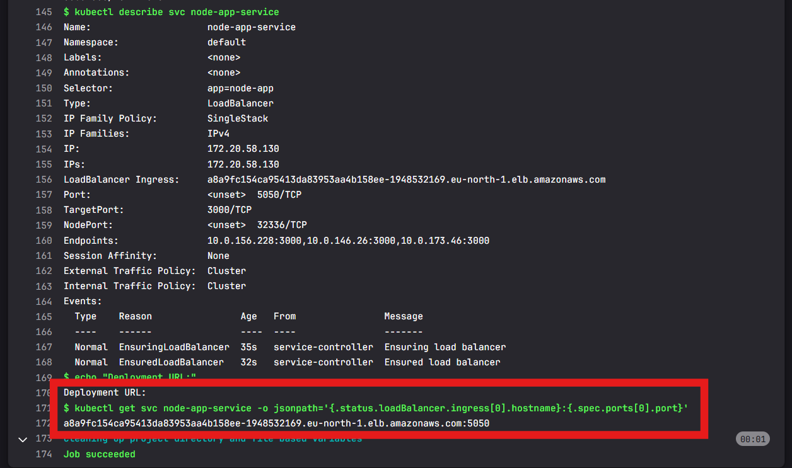
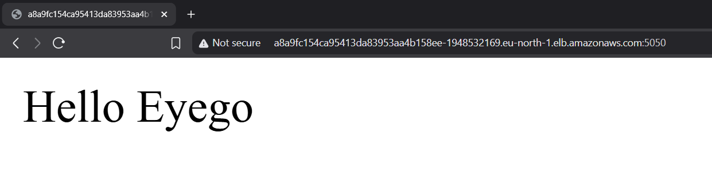

# Eyego Deployment CI/CD Pipeline

This repository automates building, scanning, and deploying a Node.js application to AWS EKS using GitLab CI/CD.

---

## Table of Contents

* [Project Structure](#project-structure)
* [Node.js App Overview](#nodejs-app-overview)
* [GitLab CI/CD Pipeline](#gitlab-cicd-pipeline)

  * [Stages](#stages)
  * [Key Jobs](#key-jobs)

    * [slack-notify](#1-slack-notify)
    * [docker-build-node](#2-docker-build-node)
    * [trivy-node](#3-trivy-node)
    * [docker-push-image](#4-docker-push-image)
    * [deploy-workload](#5-deploy-workload)
* [Requirements](#requirements)
* [Kubernetes Deployment Files](#kubernetes-deployment-files)
* [CI/CD Security Scanning](#cicd-security-scanning)
* [Final Deployment Output](#final-deployment-output)
* [Output Results](#output-results)
* [Steps for Migration into GCP or Alibaba Cloud](#steps-for-migration-into-gcp-or-alibaba-cloud)


---


# Eyego Deployment CI/CD Pipeline

This repository automates building, scanning, and deploying a Node.js application to AWS EKS using GitLab CI/CD.

---

## Table of Contents

* [Project Structure](#project-structure)
* [Node.js App Overview](#nodejs-app-overview)
* [GitLab CI/CD Pipeline](#gitlab-cicd-pipeline)

  * [Stages](#stages)
  * [Key Jobs](#key-jobs)

    * [slack-notify](#1-slack-notify)
    * [docker-build-node](#2-docker-build-node)
    * [trivy-node](#3-trivy-node)
    * [docker-push-image](#4-docker-push-image)
    * [deploy-workload](#5-deploy-workload)
* [Requirements](#requirements)
* [Kubernetes Deployment Files](#kubernetes-deployment-files)
* [CI/CD Security Scanning](#cicd-security-scanning)
* [Final Deployment Output](#final-deployment-output)
* [Output Results](#output-results)
* [Steps for Migration into GCP or Alibaba Cloud](#steps-for-migration-into-gcp-or-alibaba-cloud)
* [License](#license)

---

## Project Structure

```
├── cluster-workloads/
│   ├── deployment.yaml      
│   ├── pod.yaml             
│   └── service.yaml         
├── nodejs/
│   ├── app.js              
│   ├── Dockerfile           
│   └── package.json         
└── .gitlab-ci.yml           
```


---

## Node.js App Overview

Located in the `nodejs/` folder, this application uses Express to create a simple web server:

```js
const express = require('express');
const app = express();
const port = 3000;

app.get('/', (req, res) => {
  res.send('Hello Eyego');
});

app.listen(port, () => {
  console.log(`Server running at http://localhost:${port}`);
});
```


---

## GitLab CI/CD Pipeline

### Stages

* **notify**: Slack notification before the deployment starts
* **build**: Build and save the Docker image
* **security-scan**: Scan the image with Trivy
* **deploy**: Push image to AWS ECR and deploy to AWS EKS

### Key Jobs

#### 1. `slack-notify`

Sends a Slack message with deployment details using webhook `$SLACK_WEBHOOK`.

#### 2. `docker-build-node`

Builds the Docker image from `nodejs/` and saves it as `node-image.tar`.

#### 3. `trivy-node`

Runs [Trivy](https://github.com/aquasecurity/trivy) to perform vulnerability scanning:

* Uses a cache for faster scans
* Generates a JSON report for GitLab

#### 4. `docker-push-image`

* Loads the image
* Tags it with `$PUBLIC_ECR_IMAGE`
* Pushes it to AWS ECR Public

#### 5. `deploy-workload`

* Installs `kubectl` and AWS CLI
* Authenticates to EKS using IAM credentials
* Applies Kubernetes manifests (`deployment.yaml`, `service.yaml`)
* Outputs deployment details

---

## Requirements

Set the following CI/CD variables in GitLab:

* `AWS_IAM_ACCESS_KEY`
* `AWS_IAM_SECRET_KEY`
* `AWS_REGION`
* `CLUSTER_NAME`
* `PUBLIC_ECR_IMAGE`
* `SLACK_WEBHOOK`

---

## Kubernetes Deployment Files

Located in `cluster-workloads/`. These define how the application is deployed, exposed, and managed in the cluster.

* `deployment.yaml`: Defines a Deployment with image pulled from ECR public registry.
* `service.yaml`: Exposes the app using a LoadBalancer service

---

## CI/CD Security Scanning

Trivy scans the Docker image using 3 commands:

* `exit-code 0`: Report all vulnerabilities
* `exit-code 1 --severity CRITICAL`: Fail pipeline on critical vulnerabilities
* Output stored as `$FULL_IMAGE_NAME-scanning-report.json`

---

## Final Deployment Output

After deployment, logs include:

* Running pods
* Deployment status
* Service status
* External Load Balancer URL:

```
Deployment URL:
<load-balancer-host>:<port>
```

---

## Output Results





---

## Steps for Migration into GCP or Alibaba Cloud

### 1. Set proper **Network Configurations** and **Security Groups**.

### 2. Create your **Cluster** and **Image Registry**.

 - Called **Artifact Registry** in GCP
 - Called **Alibaba Container Registry (ACR)** in Alibaba Cloud

### 3. In `docker-push-image` job:
* Make sure to install the proper `CLI` the matches your cloud provider and configure the user.
* Authenticate with your **Image Registry** and push the docker image into it.

### 4. In `deploy-workload`:
* Make sure to install the proper `CLI` the matches your cloud provider and configure the user.
* Update `kubeconfig` to match your Kubernetes Engine.